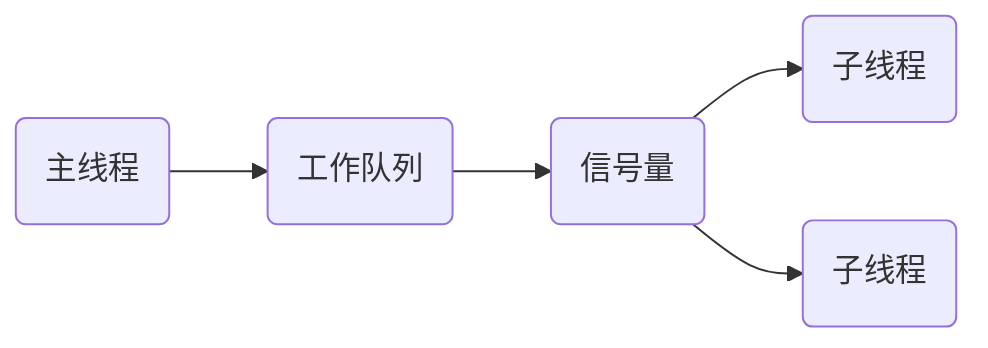

# 项目实战

**网络IO接口调用**分为两个阶段：

1. 数据就绪：阻塞、非阻塞

阻塞：调用API的进程/线程进入阻塞状态，当没有数据在缓冲区时，进程/线程被挂起

非阻塞：若内核缓冲区没有数据可读，返回一个错误不会被阻塞；当有数据可读时，拷贝数据返回

阻塞与非阻塞与API无关，是应用层自己设计的。API是否阻塞是开发者决定的。

2. 数据读写：同步、异步

同步：调用API时，数据的读写是由应用层自己来完成。当数据读完程序才会继续执行，否则一直阻塞。

异步：调用API时，操作系统来帮忙处理，给这个API指定一个接收缓冲区。向操作系统传入请求的事件以及事件完成时的通知方式（回调函数），当操作系统监听到事件发生并处理完成后，按照事先约定好的方式通知应用程序。

只有特殊API是异步，比如`aio_read`

## 五种IO模型

1. 阻塞IO模型

进程发起IO系统调用后，进程被阻塞（等待这个调用返回，期间什么也不做，直到函数返回），转到内核空间处理，整个IO处理完毕后返回进程。操作成功则进程获取到数据。

每个进程只能检测一个请求。

不适用并发量大的应用：因为一个请求IO会阻塞进程，所以，得为每个请求分配一个处理进程（线程）以及时响应，系统开销大。

进程阻塞挂起不消耗CPU资源，及时响应每个操作，适用于并发量小的网络应用开发。

2. 非阻塞IO模型

进程发起IO系统调用后，每隔一段时间检测IO事件是否就绪。如果内核缓冲区没有数据，需要到IO设备中读取，进程返回一个错误而不会被阻塞；进程发起IO系统调用后，如果内核缓冲区有数据，内核就会把数据返回进程。

如recvfrom系统调用到内核空间，此时缓冲区内没有数据可读，需要到IO设备中读取，此时进程就会立刻返回一个错误`EGAIN、EWOULDBLOCK`，直到缓冲区数据准备好，开始拷贝数据，此时为阻塞状态，直到数据拷贝完毕，返回成功提示。

特点：进程重复调用，消耗CPU资源，适用于并发量小、不需要及时响应的网络应用开发。

3. IO复用模型

多个进程的IO注册到一个复用器上，用一个进程调用该复用器，它会监听所有注册的IO

可以同时监测多个进程的IO，可以同时阻塞多个IO操作，同时对多个读操作、写操作进行监测，直到有数据可以读、写时，才真正调用IO操作函数。

特点：单一进程解决多个进程IO的阻塞问题，性能好，`Reactor`，适用高并发服务应用开发。

4. 信号驱动

当进程发起一个IO操作，会向内核注册一个信号处理函数，然后进程返回不阻塞；当内核数据就绪时会发送一个信号给进程，进程便在信号处理函数中调用IO读取数据。

5. 异步IO模型

当进程发起一个IO操作，内核把整个IO处理完后，会通知进程结果。如果IO操作成功则进程直接获取到数据。

可以将阻塞IO、非阻塞IO、IO复用模型都归结为一类，因为不管调用API的进程/线程是都阻塞，当数据来临时，拷贝数据都是阻塞的。也可以将阻塞与非阻塞都理解为同步的，因为数据的读写都是应用层自己来完成。

## Web服务器简介、HTTP协议

### Web服务器工作原理


实质就是一个简单的网络通信

服务器主要有三个工作：接受数据，处理数据，发送数据

Web服务器本质：

```tex
接收数据 -> HTTP解析 -> 逻辑处理 -> HTTP封包 -> 发送数据
```

细致的流程：

(1) 用户做出了一个操作，可以是填写域名、IP加端口号，可以是点击链接，可以是点击按键等，接着浏览器获取了该事件。

(2) 浏览器与对端服务程序建立TCP连接。

(3) 浏览器将用户的事件按照HTTP协议格式打包成一个数据包，其实质就是在待发送缓冲区中的一段有着HTTP协议格式的字节流。

(4) 浏览器确认对端可写，并将该数据包推入Internet，该包经过网络最终递交到对端服务程序。

(5) 服务端程序拿到该数据包后，同样以HTTP协议格式解包，然后解析客户端的意图。

(6) 得知客户端意图后，进行分类处理，或是提供某种文件、或是处理数据。

(7) 将结果装入缓冲区，或是HTML文件、或是一张图片等。

(8) 按照HTTP协议格式将(7)中的数据打包

(9) 服务器确认对端可写，并将该数据包推入Internet，该包经过网络最终递交到客户端。

(10) 浏览器拿到包后，以HTTP协议格式解包，然后解析数据，假设是HTML文件。

(11) 浏览器将HTML文件展示在页面

举例子，淘宝网的nginx服务器会调用listen来监听80端口，当在浏览器输入淘宝网或者服务器地址加端口号时，服务器会跟浏览器建立TCP连接，进行数据通信。

### HTTP协议

超文本传输协议`Hypertxt Transfer Protocal`，运行在TCP之上，基于请求-响应模式。指定了客户端可能发送给服务器端什么样的消息以及得到什么样的响应，消息的头部以ASCII形式给出，消息内容是一个类似`MIME` 的格式。

一个响应由四部分组成：状态行、响应头部、空行、响应数据

例子：浏览器地址栏输入URL，按下回车经历以下几个流程：

1.浏览器向DNS服务器请求解析该URL中的域名锁对应的IP地址

2.根据IP地址和默认端口80，和服务器建立TCP连接

3.浏览器发出读文件的HTTP请求，该请求报文作为TCP三次握手的第三个报文的数据发送给服务器

4.服务器对浏览器请求做出响应，将对应的HTML文本发送给浏览器

5.释放TCP连接

6.浏览器将该HTML文本显示内容

HTTP请求报文格式：


```http
GET / HTTP/1.1
Host: www.baidu.com
Connection: keep-alive
Cache-Control: max-age=0
sec-ch-ua: " Not A;Brand";v="99", "Chromium";v="99", "Microsoft Edge";v="99"
sec-ch-ua-mobile: ?0
sec-ch-ua-platform: "Windows"
Upgrade-Insecure-Requests: 1
User-Agent: Mozilla/5.0 (Windows NT 10.0; Win64; x64) AppleWebKit/537.36 (KHTML, like Gecko) Chrome/99.0.4844.74 Safari/537.36 Edg/99.0.1150.55
Accept: text/html,application/xhtml+xml,application/xml;q=0.9,image/webp,image/apng,*/*;q=0.8,application/signed-exchange;v=b3;q=0.9
Sec-Fetch-Site: same-origin
Sec-Fetch-Mode: navigate
Sec-Fetch-User: ?1
Sec-Fetch-Dest: document
Referer: https://www.baidu.com/s?tn=44004473_48_oem_dg&ie=utf-8&wd=%E7%99%BE%E5%BA%A6
Accept-Encoding: gzip, deflate, br
Accept-Language: zh-CN,zh;q=0.9,en;q=0.8,en-GB;q=0.7,en-US;q=0.6
Cookie: BIDUPSID=5F3C845C19AFEFB703A6023F09D5B6B2; PSTM=1641474937; BAIDUID=5F3C845C19AFEFB7E967C2983F32F566:FG=1; BD_UPN=12314753;
```

HTTP响应报文格式

```http
HTTP/1.1 200 OK
Bdpagetype: 2
Bdqid: 0xad22c5a400059575
Cache-Control: private
Connection: keep-alive
Content-Encoding: gzip
Content-Type: text/html;charset=utf-8
Date: Thu, 31 Mar 2022 03:27:05 GMT
Expires: Thu, 31 Mar 2022 03:27:04 GMT
Server: BWS/1.1
Set-Cookie: BDSVRTM=689; path=/
Set-Cookie: BD_HOME=1; path=/
Set-Cookie: H_PS_PSSID=36069_36177_31254_36005_36087_36166_34584_36142_36120_36194_36074_36125_35863_35319_26350_36111_36047_36092_36061; path=/; domain=.baidu.com
Strict-Transport-Security: max-age=172800
Traceid: 1648697225354701543412475751225935369589
X-Frame-Options: sameorigin
X-Ua-Compatible: IE=Edge,chrome=1
Transfer-Encoding: chunked
```

URL地址组成

```http
http://10.1.192.66:8181/VPNMS/page/main.jsp
https://baike.baidu.com/item/url/110640?fr=aladdin
```

http 协议

10.1.192.66:8181 主机名

baike.baidu.com 域名

/item/url/110640 路径，访问的资源在服务器下的相对路径

fr=aladdin  参数，多个参数用&隔开

### 服务器编程基本框架


几个主要模块：

**IO处理单元**：处理客户连接，读写网络数据

**逻辑单元**：业务进程或线程。分析并处理数据，将结果传递给IO处理单元或者直接发送给客户端。一个逻辑单元是一个进程或者线程，服务器有多个逻辑单元，实现对多个客户端任务的并发处理。

**网络存储单元**：数据库、文件、缓存

**请求队列**：各单元之间的通信方式。IO处理单元接收到客户请求时，需要以某种方式通知一个逻辑单元来处理该请求。同样，多个逻辑单元同时访问一个存储单元时，也需要采用某种机制来协调处理，请求队列通常被成为池 的一部分。（进程间通信、线程间通信）

### 事件处理模式

服务器程序需要处理三类事件：IO事件、信号、定时事件

#### Reactor模式

适用于同步IO模型

要求主线程（I/O处理单元）只负责监听文件描述符上是否有事件发生，有的话立即将该事件通知工作线程（逻辑单元），将`socket`可读可写事件加入请求队列，交给工作线程处理。除此之外，主线程不做任何实质性的工作，读写数据、接受新的连接，以及处理客户请求均在工作线程中方完成。

使用同步I/O以epool_wait为例实现的Reactor模式的工作流程：

1. 主线程往 epoll 内核事件表中注册 socket 上的读就绪事件。 
2. 主线程调用 epoll_wait 等待 socket 上有数据可读。 
3. 当 socket 上有数据可读时， epoll_wait 通知主线程。主线程则将 socket 可读事件放入请求队列。 
4. 睡眠在请求队列上的某个工作线程被唤醒，它从 socket 读取数据，并处理客户请求，然后往 epoll 内核事件表中注册该 socket 上的写就绪事件。
5. 当主线程调用 epoll_wait 等待 socket 可写。 
6. 当 socket 可写时，epoll_wait 通知主线程。主线程将 socket 可写事件放入请求队列。
7. 睡眠在请求队列上的某个工作线程被唤醒，它往 socket 上写入服务器处理客户请求的结果。

#### Proactor模式

适用于异步IO模型

**使用同步IO模拟proactor模式**

原理：主线程执行读写操作，读写完成后，主线程向工作线程通知这一完成事件。从工作线程的角度：直接获得了读写的结果，接下来要做的仅是对读写的结果进行逻辑处理。

使用同步I/O 以(epool_wait)为例实现Proactor模式的工作流程

1. 主线程往 epoll 内核事件表中注册 socket 上的读就绪事件
2. 主线程调用 epoll_wait 等待 socket 上有数据可读
3. 当 socket 上有数据可读时，epoll_wait 通知主线程。主线程从 socket 循环读取数据，直到没有更多数据可读，然后将读取到的数据封装成一个请求对象并插入请求队列
4. 睡眠在请求队列上的某个工作线程被唤醒，它获得请求对象并处理客户请求，然后往 epoll 内核事件表中注册 socket 上的写就绪事件
5. 主线程调用 epoll_wait 等待 socket 可写
6. 当 socket 可写时，epoll_wait 通知主线程。主线程往 socket 上写入服务器处理客户请求的结果。


#### 有限状态机

逻辑单元内部的一种高效编程方法

```c
//  每个状态都相互独立的状态机
STATE_MACHINE( Package _pack )
{
    PackageType _type = _pack.GetType();
    switch( _type )
    {
        case type_A:
            process_package_A( _pack );
            break;
        case type_B:
            process_package_B( _pack );
            break;
    }
}
```

```c
/*  该状态机包含三种状态：type_A、type_B 和 type_C，其中 type_A 是状态机的开始状态，type_C 是状态机的结束状态。状态机的当前状态记录在 cur_State 变量中。在一趟循环过程中，状态机先通过 getNewPackage 方法获得一个新的数据包，然后根据 cur_State 变量的值判断如何处理该数据包。数据包处理完之后，状态机通过给cur_State 变量传递目标状态值来实现状态转移。那么当状态机进入下一趟循环时，它将执行新的状态对应的逻辑。*/
STATE_MACHINE()
{
    State cur_State = type_A
    while( cur_State != type_C )
    {
        Package _pack = getNewPackage();
        switch( cur_State )
        {
            case type_A:
                process_package_state_A( _pack );
                cur_State = type_B;
                break;
            case type_B:
                process_package_state_B( _pack );
                cur_State = type_C;
                break;
        }
    }
}
```

#### 压力测试  webbench-1.5

出错 `Bad Request`

解析出错

```html
HTTP/1.1 400 error_400_title. Bad Request
Content-Length: 84
Content-Type:text/html
Connection: close

error_400_form. Your request has bad syntax or is inherently impossible to satisfy.
epoll_ctl: No such file or directory
```

重新测试发现，服务器没有并发能力，当并发数量大于1时，报错失败

```shell
[root@bogon webserver]# g++ *.cpp -pthread
[root@localhost webbench-1.5]# ./webbench -c 1 -t 5
http://192.168.245.128:10000/index.html
Webbench - Simple Web Benchmark 1.5
Copyright (c) Radim Kolar 1997-2004, GPL Open Source Software.

Benchmarking: GET http://192.168.245.128:10000/index.html
1 client, running 5 sec.

Speed=626640 pages/min, 2005248 bytes/sec.
Requests: 52220 susceed, 0 failed.
[root@localhost webbench-1.5]# ./webbench -c 2 -t 5 http://192.168.245.128:10000/index.html
Webbench - Simple Web Benchmark 1.5
Copyright (c) Radim Kolar 1997-2004, GPL Open Source Software.

Benchmarking: GET http://192.168.245.128:10000/index.html
2 clients, running 5 sec.

Speed=16366428 pages/min, 192 bytes/sec.
Requests: 6 susceed, 1363863 failed.
```

只有并发数为1时，程序可以运行/

程序代码存在严重问题。说明我的代码没有实现并发能力。只接受单连接。

重新检查程序

发现bug出现在将文件描述符从epoll实例中移除时报错

```cpp
void removefd(int epollfd, int fd) {

    if (epoll_ctl(epollfd, EPOLL_CTL_DEL, fd, 0) < 0)
         ERR_EXIT("epoll_ctl");
    close(fd);
}
```

这里有问题，因为`epoll_ctl`函数的最后一个参数是`epoll_event`类型的，这里用0会报错，检查这个错误的话程序就会终止。

```c
int epoll_ctl(int epfd, int op, int fd, struct epoll_event *event);
```

将removefd修改

```c
void removefd(int epollfd, int fd) {

    // if (epoll_ctl(epollfd, EPOLL_CTL_DEL, fd, 0) < 0)
    //     ERR_EXIT("epoll_ctl");
    epoll_ctl(epollfd, EPOLL_CTL_DEL, fd, 0);
    close(fd);
}
```

调试没有问题，压力测试也没有问题/

测试当前环境下系统内核支持的最大并发数

```shell
[root@localhost webbench-1.5]# ./webbench -c 11000 -t 5 http://192.168.245.128:10000/index.html
Webbench - Simple Web Benchmark 1.5
Copyright (c) Radim Kolar 1997-2004, GPL Open Source Software.

Benchmarking: GET http://192.168.245.128:10000/index.html
11000 clients, running 5 sec.
problems forking worker no. 10792
fork failed.: Resource temporarily unavailable
```

当并发数为11000时，提示主机用户打开的线程数超过了系统的内核参数

目前压测最大并发数为8000

### 项目整体流程图


# Linux通讯服务器架构项目

#### 实现前需要注意事项

1. SIG_PIPE信号的处理，忽略
2. 避免服务器出现TIME_WAIT状态。协议设计上，让客户端主动断开连接，将TIME_WAIT状态分散到客户端。如果客户端不活跃了，若一些恶意客户端不断开连接，这样会占用服务器的连接资源。服务器需要有个机制来处理不活跃连接
3. SIG_CHLD信号，僵尸进程的处理，忽略
4. 端口复用技术。避免当服务器先关闭时，再次绑定会出现bind: Address already in use
4. SIGHUP信号，防止终端关闭，将服务器关闭，忽略此信号

 

#### 类UNIX操作系统体系结构

体系结构分为两个态，用户态和内核态

内核：用来控制计算机硬件资源，提供应用程序运行的环境

自己写的程序，一般运行在用户态

当程序要执行特殊的代码的时候，程序可能切换到内核态，这种切换由操作系统控制，不需要人为介入，当内核处理完成后，又转回到用户态（切换越少越好，拷贝越少越好）

系统调用：系统函数（内核提供的库函数）

shell：可执行程序，把用户输入的命令翻译给操作系统（命令解析器），分割系统调用和应用程序

为什么要区分用户态和内核态？

1. 一般情况下，程序都运行在用户态，权限小，不至于危害到系统其他部分
2. 既然这些接口是系统提供的，那么这些接口也是操作系统统一管理的。资源是有限的，如果大家都来访问这些资源不加以管理的话，一个是访问冲突，一个是被访问的资源如果耗尽，系统可能面临崩溃。系统提供这些接口，目的是为了减少有限的资源的访问以及使用上的冲突。

**什么时候从用户态切换到内核态？**

1. 系统调用
2. 异常事件（比如信号等）
3. 外围设备中断

可重入函数：信号处理过程中调用它是安全的，保证调用它是安全的，并被称为异步信号

一些周知的函数都是不可重入的，malloc，printf


#### 项目代码实现规范

类命名C开头

变量名m_开头

指针p_开头

全局变量g_开头


#### 框架目录结构


#### makefile文件


#### 内存泄漏

Valgrind：寻找BUG，改进性能的工具

memcheck工具，用于检查内存泄漏

可以检查如下问题：

1. 使用未初始化的内存
2. 使用已经释放的内存
3. 使用超过了malloc的内存
4. 对堆栈的非法访问
5. malloc/free new/delete申请和释放内存的匹配

```shell
valgrind --tool=memcheck --leak-check=full --show-reachable=yes ./all
```


#### 修改可执行程序标题


默认程序的标题是启动项目时，shell行写入的内容

内存上方面：环境变量紧挨着argv数组

实现：

重新分配一块内存，用来保存环境变量environ中的内容

修改argv[0]所指向的内存


#### 主进程主函数的函数调用顺序如何安排

1. 先加载无伤大雅的函数，一些前提参数，比如命令行参数，获取进程ID等等

   argc:命令行参数的个数

   argv:是个数组，每个数组元素都是指向一个字符串的char *，里边存储的内容是所有命令行参数

2. 初始化核心文件

- 初始化日志
- 读取配置文件，将配置文件装载到内存
- 初始化内存类
- 初始化CRC32类

3. 功能函数初始化

- 初始化信号
- 初始化socket类
- 初始化环境变量
- 设置可执行程序标题、环境变量搬家

3. 创建守护进程
4. 通讯模块主流程


#### 日志文件

单例类实现


#### 项目配置文件

项目中需要的所有的配置的固定的参数的一个文本文件。

项目启动后，首先读物配置文件，将配置文件的内容读取到内存中来。

如何读取配置文件？

定义一个结构体，存放配置文件的配置项，包括配置项的名字，以及数值

定义一个单例类，用于存放配置项

主线程：创建一个单例类，将配置文件的内容读取到内存中，后续需要哪个参数直接访问内存即可。


#### 信号模块

自定义信号结构体，信号数组

```c
struct web_signal_t
{
    int s_signo;                                                         // 信号数字编号
    const char * s_signame;                                              // 信号名字
    void (*handler)(int s_signal, siginfo_t * siginfo, void * ucontext); // 信号处理函数指针
};
web_signal_t  signals[] = {};
```

目前监控的信号：SIGHUP、SIGINT、SIGTERM、SIGCHLD、SIGQUIT、SIGIO、SIGSYS

信号初始化，目前只有僵尸进程的处理程序，其他信号待补充（暂时为忽略初略）

`sigaction`修改信号的处理动作，当接收到一个信号时

1. 若是项目检测的信号集中，就用项目编写的对应的信号处理动作
2. 若不在信号集中，内核默认处理

```c++
int web_init_signals() {
    struct sigaction sa;  // 信号处理结构体
    for (web_signal_t * sig = signals; sig->s_signo != 0; sig++) {
        memset(&sa, 0, sizeof(struct sigaction)); // 首先清空结构体
        if (sig->handler) {
            // 若信号处理函数不为空，将当前信号的处理函数设置为本项目的信号处理函数（信号处理函数默认为SIG_DEL），将标志位置为SA_SIGINFO，使用 sa_sigaction 成员而不是 sa_handler 作为信号处理函数
            sa.sa_sigaction = sig->handler;
            sa.sa_flags = SA_SIGINFO;
        } else {
            // 当前信号不在项目信号数组中，做忽略处理
            sa.sa_handler = SIG_IGN;
        }
        sigemptyset(&sa.sa_mask); // 处理信号时，不阻塞其他信号，可以收到其他信号
        
        if (sigaction(sig->s_signo, &sa, NULL) == -1) {
			// sigaction()修改当前信号的处理动作，前边已经设置信号的处理动作了
            // 失败显示打印到日志中
            LOG_ERROR("sigaction(%s) failure\n", sig->s_signame);
            return -1;
        }
    }
}
```

信号处理程序

```c++
void web_signal_handler(int s_signo, siginfo_t * siginfo, void * ucontext) {
    web_signal_t * sig;
    char * action;
    //在信号集中找当前信号
    for (sig = signals; sig->s_signo != 0; sig++) {
        if (sig->s_signo == s_signo) {
            break;
        }
    }
    action = (char *)"";

    if (web_process == WEB_PROCESS_MASTER) {  // master进程
        switch (s_signo)
        {
        case SIGCHLD:
            web_reap = 1; // 标记子进程状态发生变化
            break;
        
        // ……其他信号后续再补充

        default:
            break;
        }
    } else if (web_process == WEB_PROCESS_WORKER) { // worker进程
        
    } else {
        // ……
    }

    // 记录日志信息
    if(siginfo && siginfo->si_pid) {
        // si_pid = sending process ID【发送该信号的进程id】
        LOG_INFO("signal %d (%s) received from %d %s", sig->s_signo, sig->s_signame, siginfo->si_pid, action);
    
    } else {
        // 没有发送该信号的进程id，所以不显示发送该信号的进程id
        LOG_INFO("signal %d (%s) received %s", sig->s_signo, sig->s_signame, action);
    }
    //执行具体信号处理函数
    if (s_signo == SIGCHLD) {
        web_process_get_status();
    }
    return ;
}
```

#### 僵尸进程处理

加入僵尸进程处理函数，但是僵尸进程依然存在

```shell
   PID   PPID    SID TT         PGRP COMMAND         STAT CMD
 19724      1  19724 ?         19724 webserver       Rs   master process ./webserver
 19725  19724  19724 ?         19724 webse <defunct> Z    [webserver] <defunct>
 19726  19724  19724 ?         19724 webserver       R    worker process
 19727  19724  19724 ?         19724 webserver       R    worker process
 19728  19724  19724 ?         19724 webserver       R    worker process
```

检查代码

\

引入一个sigsuspend函数

```c
int sigsuspend( const sigset_t *sigmask );
```

调用该函数后，将进程的信号屏蔽字设置为sigmask指向的值，进程被挂起。当收到一个信号时，执行该信号的信号处理程序且恢复原先的信号屏蔽。信号处理函数返回后，程序继续运行。

白话就是调用这个函数，进程会阻塞成sigmask信号屏蔽集，一直等到有信号来临，才继续往下走

在主进程调用这个函数，用于当子进程关闭向主进程发送SIGCHLD信号时，处理僵尸进程

\

加入sigsuspend函数后。worker进程与，master进程都关闭

```shell
   PID   PPID    SID TT         PGRP COMMAND         STAT CMD
 20253      1  20251 ?         20251 webserver       R    worker process
 20254      1  20251 ?         20251 webserver       R    worker process
 20255      1  20251 ?         20251 webserver       R    worker process
```

问题已解决

```c++
void web_process_get_status(void)
{
    while (1)
    {
        /*
            当有子进程退出时，调用这个处理函数
            第一次调用返回一个 >0 的值，表示想要退出的子进程成功退出，将其写入日志中
            第二次调用返回0，表示其他子进程还没有结束，return退出
        */
        pid = waitpid(-1, &status, WNOHANG); // -1表示等待任何子进程的退出
                                             // status保存子进程的状态信息
                                             // WNOHANG表示不要阻塞，让waitpid()立即返回
        if (pid == 0) {
            // 子进程没有结束
            return;

        } else if (pid == -1) {
            // 出错，打印错误信息……

        } else {

            //  >0 表示成功（返回值就是子进程的PID）
            // 打印日志……
        }
    }
}
```


#### 守护进程实现

守护进程：

- 必须调用两次fork
- 必须没有终端
- 必须以root权限运行

创建守护进程的时机，在创建子进程之前

```c++
// 守护进程
// 失败返回-1，子进程返回0，父进程返回1
int web_proc_daemon()
{
    switch (fork()) {
    case -1:
        LOG_ERROR("ngx_daemon()中fork()失败!");
        return -1;
    case 0:// 子进程
        break;
    default:// 父进程
        return 1;
    }
    // 将原先的子进程ID赋给当前新的父进程，将当前进程ID赋给当前进程（master进程）
    web_ppid = web_pid;
    web_pid = getpid();

    if (setsid() == -1) {
        // 建立新会话，脱离终端，成为新的会话组组长
        LOG_ERROR("ngx_daemon()中setsid()失败!");
        return -1;
    }
    umask(0);

    int fd = open("/dev/null", O_RDWR);  // 打开黑洞 【文件路径/dev/null】
    if (fd == -1) {
        LOG_ERROR("ngx_daemon()中open(\"/dev/null\")失败!");
        return -1;
    }

    if (dup2(fd, STDIN_FILENO) == -1) {
        // 将标准输入关闭，将标准输入重定向到黑洞，再写入就是丢尽黑洞，无效
        LOG_ERROR("ngx_daemon()中dup2(STDIN)失败!");
        return -1;
    }

    if (dup2(fd, STDOUT_FILENO) == -1) {
        LOG_ERROR("ngx_daemon()中dup2(STDOUT)失败!");
        return -1;
    }

    if (fd > STDERR_FILENO) {
        // fd此时应该是3，保留标准错误，将fd关闭
        if (close(fd) == -1) {

            LOG_ERROR("ngx_daemon()中close(fd)失败!");
            return -1;
        }
    }
    return 0;
}
```

master进程的父进程是1，worker进程的父进程都是master

TTY = ？表示已经脱离终端

## 2.通讯模块

逐层调用

### 1.流程函数

```c++
//master process ./nginx 
//worker process
web_master_process_cycle()        //主进程函数
	web_setproctitle()            //设置进程标题    
	web_start_worker_processes()  //创建worker子进程
		for (i = 0; i < threadnums; i++)   //master进程在走这个循环，来创建若干个子进程
            web_spawn_process(i,"worker process");
                pid = fork(); // 创建子进程，master进程直接返回，子进程开启功能端口并保持运行
				pid > 0 // 直接返回
                pid = 0 web_worker_process_cycle(inum,pprocname);  //子进程功能端口
                    web_worker_process_init();  //子进程初始化函数
                        sigemptyset(&set);
                        sigprocmask(SIG_SETMASK, &set, NULL); //允许接收所有信号
						web_thread.create(threadcount); //创建线程池【处理各种业务逻辑】
						web_socket.worker_Initialize(); //子进程初始化【开启发送消息、延迟回收、心跳检测线程】
						g_socket.web_open_listening_sockets(); //开启监听端口
						web_socket.web_epoll_init(); //epoll初始化，开启监听事件
                    web_setproctitle(pprocname); //重新为子进程设置标题为worker process
					while (1) // 子进程s
                        web_socket.web_epoll_event_driving(-1); // epoll事件驱动
					web_thread.close(); //关闭线程池
    				web_socket.worker_Shutdown(); //子进程退出
	sigemptyset(&set); // 子进程创建完毕，回到主进程
	while (1) // 死循环，接收信号唤醒
		sigsuspend(&set);
```


### 2.子进程模块

子进程个数配置成与CPU个数相同，设置在配置文件中

```shell
cat /proc/cpuinfo| grep "physical id"| sort| uniq| wc -l  // 查看CPU个数 4（可通过虚拟机设置） 
```

杀死整个进程组

```shell
kill -9 -[PGRP]
```


#### 2.1线程池

**当一个进程运行之后，缺省地自动开启一个主线程**

线程池，一组子线程，运行相同的代码。有新的任务到来时，主线程通过算法选择一个空闲子线程为之服务。相比动态创建子线程（来一个任务创建一个）效率好很多。

实现方式：

1. 随机算法 

2. `Round Robin`轮流选取算法

3. 主线程和子线程共享一个工作队列。有新任务到来 ，放到工作队列中

线程池特点：

1. 空间换时间，通过服务器的硬件资源换取运行效率

2. 池是一组资源的集合，在服务器启动之初就被完全创建好并初始化，成为静态资源
3. 当服务器进入正式运行阶段，开始处理客户请求时，需要相关资源可以直接从池中获取，无需动态分配
4. 当服务器处理完一个客户连接后，可以将相关资源放回池中，无需执行系统调用释放资源

升级的线程池可以是，动态地分配池中的数量

多线程首要要考虑的问题是，线程数据安全，线程同步，本项目采用互斥锁。

线程间的通信方式，信号量。



必须判断线程池是否启动完毕，否则极端情况下，没等到创建完毕就关闭线程池会造成线程池混乱

**使用互斥锁的时候，加锁的同时别忘了解锁！**

```c++
void CThreadpool::add_request_msgList(web_conn_t *p)
{
    // 收到数据后经初步判断没有问题加入到消息队列中
	m_MsgRecvList.push_back(p->precvbufdel); // 消息队列入队
    m_msgcount++;
    append() // 通知线程
    {
        // 线程驱动函数，唤醒一个睡眠中的工作子线程
    	m_cond.signal();// 条件变量加一
    }
}
private:
// 线程执行函数
static void * worker(void * arg)
{
    ThreadItem * p = (ThreadItem *) arg; 
    CThreadpool * pool = (CThreadpool *) p->_pThis; // p->_pThis = this
    pool->run(p);
    return (void*)0;
}
void CThreadpool::run(ThreadItem * p)
{
    // 子线程工作函数
    while (true)
    {
        m_locker.lock();
        while (m_MsgRecvList.size() == 0 && m_stop == false)
        {
            // 确保线程穷启动起来
            if (p->ifrunning == false) {
                p->ifrunning = true;
            }
            m_cond.wait(m_locker.get());
            // pthread_cond_wait(&cond, mutex);
		        //1线程放在等待队列上，解锁
		        //2等待 pthread_cond_signal 或者 pthread_cond_broadcast信号之后去竞争锁
		        //3若竞争到互斥索则加锁
        }
        buf = m_MsgRecvList.front();// 从消息队列获取消息
        m_MsgRecvList.pop_front();
        m_msgcount--;
        m_locker.unlock();
        web_socket.process_request(buf);// 消息处理函数
    }
}
```

#### 2.2子进程初始化函数

开启三个专用线程：

- 发送消息专用线程
- 回收连接专用线程
- 心跳检测专用线程

```c++
/*子进程初始化函数*/
web_worker_process_init()
    sigemptyset(&set);
	sigprocmask(SIG_SETMASK, &set, NULL); //接收任何信号
	web_thread.create(threadcount); //创建线程池【处理各种业务逻辑】
    web_socket.worker_Initialize(); //子进程初始化【开启：发送消息线程、延迟回收线程、心跳检测线程】
	g_socket.web_open_listening_sockets(); //开启监听端口
	
```

#### 2.3开启监听端口

##### 重要技术：端口复用技术

```c
int setsockopt(int sockfd, int level, int optname, const void *optval, socklen_t optlen);
//参数选择：
//level：功能端口复用SOL_SOCKET
//optname：选型类型
//optval：大于0即可
```

1. 在绑定地址之前调用，保证不会出现bind: Address already in use错误

optname设为SO_REUSEADDR，打开地址复用功能

SO_REUSEADDR选项，TCP不支持两个相同的IP地址和端口绑定不同的套接字。（UDP支持）

2. 解决惊群问题

##### 惊群

一个master进程，4个worker进程

当一个连接进来，惊动了4个worker进程，只有一个worker进程会accept成功，其余三个均失败，相当于做了无用功，对系统进行一定的额外消耗

如何解决惊群？

1. 进程锁
2. reuseport【端口复用】允许任意数量的socket绑定到完全相同的源地址端口对上，只要所有之前绑定的socket都设置了`SO_REUSEPORT`选项。如果第一个绑定在该地址端口对上的socket没有设置`SO_REUSEPORT`，无论之后的socket是否设置`SO_REUSEPORT`，其都无法绑定在与这个地址端口完全相同的地址上

程序改进

在worker进程中开启监听端口，解决惊群问题。因为在master进程中开启监听端口，监听套接字完全相同，并不能解决惊群问题

将函数改成public类型，子类方便调用

保证每个子进程的套接字都是独立的，它们都有自己的accept队列，由内核来做负载均衡。

#### 2.4epoll初始化，开启监听事件

创建epoll实例m_epfd

初始化连接池m_connList，空闲连接池m_connFree

将listenfd加入到m_connList中

将listenfd加入到m_epfd中，listenfd只负责接收新的请求，因此只开启读事件

设置listenfd读事件的处理函数web_event_accept

```c++
web_socket.web_epoll_init() // epoll初始化
	m_epfd = epoll_create(m_worker_MaxConns); // 创建epoll实例
	for (int i = 0; i < m_worker_MaxConns; i++) {}; // 初始化连接池
        p_conn->web_init_conn();       // 初始化连接
        m_connList.push_back(p_conn);  // 加入到连接池
        m_connFree.push_back(p_conn);  // 加入空闲连接池
	for (pos = m_ListenSocketList.begin(); pos != m_ListenSocketList.end(); pos++)
		web_conn_t * p_conn = web_get_free_conn((*pos)->listen_fd); //从空闲连接池队列中获取一个空闲连接
        p_conn->rhandler = &CSocket::web_event_accept; // 设置监听套接字的读事件的处理方法【TCP三次握手请求处理函数】
        web_epoll_add_event(); // 将监听套接字添加到epoll实例中
```


### 3.Socket通信套接字类

固定功能，包括创建连接池、数据包收发操作、延迟回收连接、心跳检测功能

业务逻辑功能在socket子类CLogic中实现，保证socket类是可移植的

#### 3.1socket初始化

读取配置文件的端口readConf

socket初始化主要工作就是读取配置文件

socket初始化由子类CLogic初始化时调用

#### 3.2连接池

连接池是创建和管理一个连接的缓冲池的技术，这些连接准备好被任何需要它们的线程使用，灵活创建一个连接池，保存已连接的套接字信息。就是在内存开辟一块空间，创建一个数组。

连接池的机制：
前提：为数据库连接建立一个缓冲池
1：从连接池获取或创建可用连接
2：使用完毕之后，把连接返回给连接池
3：在系统关闭前，断开所有连接并释放连接占用的系统资源
4：能够处理无效连接，限制连接池中的连接总数不低于或者不超过某个限定值

##### 连接池和线程池的区别：

连接池：
1、连接池是面向数据库连接的
2、连接池是为了优化数据库连接资源
3、连接池有点类似在客户端做优化
线程池：
1、线程池是面向后台程序的
2、线程池是是为了提高内存和CPU效率
3、线程池有点类似于在服务端做优化

连接套接字结构体

连接池初始化，在子进程初始化中完成，开启监听事件，主进程不处理业务逻辑

本项目另外建立一个空闲连接池，初始化时，将连接同时加入到连接池中空闲连接池中。有连接过来，向空闲连接池中拿一个连接，连接池中不用动（这个连接同时在连接池中），TCP连接关闭后，将连接回收到空闲连接池中即可。当连接池满了，重新分配一块内存，加入到连接池中。

本项目连接池初始化为1024个，但不是上限，上限最大可以通过配置文件设置。

```c++
// 初始化连接池
for (int i = 0; i < m_worker_MaxConns; i++) {
    p_conn->web_init_conn();       // 初始化连接
    m_connList.push_back(p_conn);  // 加入到连接池
    m_connFree.push_back(p_conn);  // 加入空闲连接池
};     
```


### 4.事件驱动框架

由事件发生源【TCP连接、已连接TCP有数据可堵可写、TCP关闭】产生事件

通过事件收集器【epoll_wait】收集

分发给消费者【监听套接字的处理程序，已连接客户端的处理程序】来处理

**事件驱动框架在子进程功能函数中循环掉调用**

```c++
web_worker_process_cycle(inum,pprocname);   // 子进程功能端口
	web_socket.web_epoll_event_driving(-1); // epoll事件驱动
		int nready = epoll_wait(m_epfd, m_events, WEB_MAX_EVENTS, timer);
		// nready > 0，有事件到来
		for (int i = 0; i < nready; i++)
        	p = (web_conn_t*)(m_events[i].data.ptr); // 取出文件描述符在连接池中的地址
    		(this->*(p->rhandler)) (p);/*处理读操作请求*/
        		// 监听端口有事件到来：head->rhandler = &CSocket::web_event_accept;
            	// 已连接套接字有事件到来：head->rhandler = &CSocket::web_request_read;
        	(this->*(p->whandler)) (p);/*处理写操作请求*/
        		// 已连接套接字有事件到来：head->whandler = &CSocket::web_request_write;
```

### 5.TCP 连接请求

监听套接字有事件发生，一定是有新的连接请求，处理三次握手

```c++
web_event_accept(web_conn_t * p_conn) 
    accept(p_conn->fd, (struct sockaddr*)&cliaddr, &cliaddrlen);//接收新连接
    newp = web_get_free_conn(conn); //将新的TCP连接加入到连接池中
    // 绑定已连接套接字处理读写操作处理函数
    newp->rhandler = &CSocket::web_request_read;
    newp->whandler = &CSocket::web_request_write;
    web_epoll_add_event(conn, EPOLL_CTL_ADD, EPOLLIN | EPOLLRDHUP, newp); //向epoll实例中添加新连接的连接，水平触发模式
    if (m_ifHeartBeat == 1) 
        web_addToTimeQueue(newp);//若开启心跳检测，将连接加入心跳队列
```


### 6.数据包收发处理流程

监听套接字采用水平触发，保证将客户端都能处理，否则容易丢掉某个客户端

已连接套接字 如果收发数据包有固定格式，采用水平触发更好

​						如果没有固定格式，采用边沿触发更好，必须循环读取才会把数据读取完全

本项目并不引入内存池，内存池主要功能就是 频繁的分配小块内存时，内存池可以节省额外内存开销

#### 6.1TCP粘包处理

定义固定数据包格式：包头 + 包体


包头：定长【记录整个数据包的长度，包头 + 包体的长度】

包体：存放完整数据

本项目选择水平触发，并设计数据包固定格式，适应于所有服务器，不单单是webserver

#### 6.2数据包格式【包头 + 包体】

**包头结构采用1字节对齐方式**

定义一种标准，保证发送方与接收方数据保存格式相同。防止数据格式乱串，比如发送方是32位的，接收方是64位的，当接收数据后，会自动保存到64位数据格式中，填充空余位，这种会造成收发内容不一致。

```c
/*使用*/
#pragma pack(1)
// 从这往后的代码都会按照1字节对齐方式……
// 包头结构体
struct comm_pkg_header
{
    unsigned short pkgLen;   //存放报文总长【包头+包体，short类型最大支持65535，数据包最长为30000，够装】【网络字节序，使用时要转换成主机字节序】
    unsigned short msgCode;  // 消息类型代码【区分不同类型的message，支持扩展】
    int crc32;               // 32位校验【防止数据包收发不一致】
};
#pragma pack()
// 恢复正常
```

另外定义一个消息头结构体，服务器收到数据包后加上消息头

功能：识别已过期数据包

服务器收到包后数据包格式为【消息头 + 包头 + 包体】

```c++
struct web_msg_header
{
    web_conn_t * p_conn;       // 数据包对应的TCP连接
    uint64_t iCurrsequence;    // 收到数据包时对应TCP连接的序号【比较连接是否已经作废】
};
```

#### 6.3收包处理

设定状态机根据状态机的值执行收报处理动作

```c
// 收包状态定义
#define _PKG_HD_INIT_       0  // 初始状态，准备接收数据包头
#define _PKG_HD_RECVING_    1  // 接收包头中，包头不完整，继续接收中
#define _PKG_BD_INIT_       2  // 包头刚好收完，准备接收包体
#define _PKG_BD_RECVING_    3  // 接收包体中，包体不完整，继续接收中，处理后直接回到_PKG_HD_INIT状态
```

```c++
unsigned char curstat;             // 当前收包状态
char dataHeadInfo[_DATA_BUFSIZE_]; // 数据包包头缓冲区
char * precvbuf;                   // dataHeadInfo缓冲区指针【白话：就是缓冲区数组下标】
unsigned int irecvlen;             // 接收数据大小
char * precvbufdel;                // 整个数据包指针【消息头 + 包头 + 包体】，释放内存指针
```

先收包头，收到完整包头处理包头【根据包头中的内容确定包体长度】，若没有包体，直接加入到消息队列

再收包体，收到完整包体，将整个数据包加入到消息队列中

不需要循环读取数据，本项目采用LT模式，有数据会一直提醒

当一次收不完，用precvbuf与irecvlen记录位置

```c++
web_request_read(web_conn_t * p)
{
    nread = read(p, p->precvbuf, p->irecvlen);
    // 有限状态机判断读取状态
    request_handler_head(p) // 收到完整包头，处理包头
    {
        // 分配内存接收包体
        p->precvbufdel = buf;  // 整个数据包指针【消息头 + 包头 + 包体】
        // 填写消息头、包头……
        // 判断总的数据包 与 包头大小
        if (m_pkglen == m_PkgHeader_len) 
            web_thread.add_request_msgList(p) // 将数据包加入消息队列中【线程池模块】
        		m_MsgRecvList.push_back(p->precvbufdel); // 消息队列入队
        		append(); // 通知线程
        	init_dataHead(p);  // 将连接池收包状态改为初始状态，方便下次收包
        else
            // 开始收包体
        	p->curstat = _PKG_BD_INIT_;                // 将状态设置为开始接收包体
        	p->precvbuf = buf + m_PkgHeader_len;       // precvbuf指向缓冲区的包体位置
        	p->irecvlen = m_pkglen - m_PkgHeader_len;  // 包体大小
    }
    web_thread.add_request_msgList(p);  // 收到完整包体，将数据包【请求】加入消息队列中
}
```

#### 6.4发包处理

LT模式下，当缓冲区有数据可写，会不停的触发socket可写事件，如何解决？

1. 调用write/send发送数据，发送完毕，将socket可写事件从epoll红黑树中移除，缺点是对效率有影响
2. 需要写数据的时候，直接调用write/send发送数据。如果返回EGAIN【发送缓冲区已满，需要等待可写事件才能继续往缓冲区写数据】，此时在将写事件加入到epoll实例中，相当于epoll驱动下写数据。优点，是数据量小的时候可以避免epoll事件的频繁ADD/MOD，提高程序的执行效率

发送数据两种实现方式：

1. 主线程实现
2. 创建一个单独的发送数据的子线程实现
3. 线程池的工作子线程处理完请求后，立马发送数据

本项目采用创建一个发送数据的专用线程，当有数据可发送时，立马调用send发送。如果发送缓冲区已满，将写事件加入到epoll实例中，等待可写事件到来时再写。

```c++
// 发送数据包相关函数
void * CSocket::sendMsg_thread(void * p_thread){} //发送数据专用的线程处理函数
void CSocket::web_request_write(web_conn_t * p){} //处理已连接套接字写操作
size_t CSocket::write(web_conn_t * p, char * buf, ssize_t buflen){} //写数据
void web_send_msg(char * psendbuf);               // 将数据包扔到发送队列中
```

1.发包之前先将数据包扔到发送队列中

仍到队列之前，检查该连接是否正常

##### 连接池连接的发送队列

给每一个连接池中的连接增加一个原子操作：待发送队列大小

若当前连接的待发送队列多大【设定400个】，认为是恶意连接，直接将其丢弃掉

```c++
atomic<int> sendQueueCount;
```

连接正常，将消息加入到消息队列

```c++
sem s_send; // 发送消息队列信号量
```

信号量加一，通知发送线程有数据包待发送

```c++
s_send.post();
```

2.发送线程

```c++
s_send.wait();
```

等待信号唤醒

直接调用send发送数据，若数据没有全部发送完毕或者返回-1，说明发送缓冲区已满，将写事件添加到epoll，等待epoll通知可写事件，再发送剩余数据包。

3.epoll通知事件可写

处理已连接套接字写操作

直接发送数据，若数据全部发送完毕，将写事件关掉。若没有全部发送完毕，记录发送位置，LT模式，等待epoll通知有事件可写

不管是发送完毕、或者对端断开，都将信号量加一，通知发送线程可以继续发送数据


### 7.Logic子类【实现业务逻辑】

创建子类全局对象 g_socket

父类的初始化在子类中调用

开发逻辑功能三个文件：web_logic_comm.h、web_logic.h、web_logic.cpp

**如何实现客户端发送过来的不同的业务逻辑处理**？

**成员函数指针 数组**

数组索引就是客户端不同的请求代码，每个请求对应一个处理函数

```c++
// 成员函数指针 
typedef bool (CLogic::*handler) (web_conn_t * p_conn, web_msg_header * p_msgHead, char * p_pkgbody, unsigned short bodylen);
// p_conn【连接池中连接的指针】
// p_msgHead【消息头指针】 
// p_pkgbody【包体指针】
// bodylen【包体长度】
static const handler statusHandler[] = 
{
    &CLogic::_HandlePing,       // 【0】心跳检测
    NULL,NULL,NULL,NULL,		// 【1-4】待开发
    &CLogic::_HandleRegister,   // 【5】注册
    &CLogic::_HandleLogIn,      // 【6】登录
};
```

#### 7.1消息处理

**当接收到客户发来的数据包后，线程池处理从消息队列中拿到数据包，交给logic子类的消息处理函数**

```c++
// 处理请求【线程池工作函数调用】【获取消息码】
void CLogic::process_request(char * buf)
{
    // buf是整个消息包括 自定义协议【消息头】 + 数据包【包头 + 包体】
    web_msg_header * p_msg = (web_msg_header*)(buf);                          // 消息头
    comm_pkg_header * p_pkghead = (comm_pkg_header*)(buf + m_MsgHeader_len);  // 包头
    char * p_pkgbody;                                                         // 包体
    unsigned short len = ntohs(p_pkghead->pkgLen);                            // 数据包长度

    // CRC校验……
    
    unsigned short msgCode = ntohs(p_pkghead->msgCode);  // 获取消息代码
    web_conn_t * p_conn = p_msg->p_conn;  // 获取连接池中的连接
    
    // 检测数据包是否为废包……
    
    (this->*statusHandler[msgCode]) (p_conn, p_msg, p_pkgbody, len);// 转去执行不同的业务逻辑
}
```

检测废包、过期包的手段

1. 文件描述符为 -1【fd】
2. 位域失效标志位不一致【instance】
3. 连接池数组的序列号不一致【icurrSequence】
4. 消息码不在服务器处理范围内【msgCode】
5. 没有对应的消息处理函数【statusHandler[msgCode]】


### 8.连接池回收问题

实例：客户A连接后执行一个10秒的业务，若在执行中A断线，假如服务器立即将连接关闭并回收连接池。此时客户B发送请求，服务器将这个连接池拿给B使用，当达到A约定的10秒时，服务器可能对这个连接池采取其他动作，这就影响了服务器的性能，因为当前是B在用这个连接池。

优化：1. 给连接池分配一块单独的内存，用完后将内存回收

​			2.延迟回收技术，服务器设定一个时间，当某一个客户断开连接后，不采取立即回收的办法，到时间后回收

#### 延迟回收技术

调用时机：

- 接收客户端数据包时，发现对方已经关闭或者有严重错误（排除EAGAIN、EINTR错误），将当前连接加入到延迟回收队列中
- 心跳检测时，对于达到最大时间额度的没有发送心跳包的连接，将其移除心跳队列，加入到延迟回收队列
- 准备发送数据包时，将数据包加入到发送队列前，若当前连接挤压过多待发送数据包，踢掉，加入延迟队列

延迟回收队列处理使用单独的线程

延迟回收队列，入队列的时候记录时间，处理线程每隔200毫秒检查一次队列，将到时间的踢掉

若要退出整个程序，强制释放整个队列

```c++
atomic<int> m_recycount;    // 延迟回收队列大小
// 将连接加入到延迟回收队列中
void CSocket::delayRecycle(web_conn_t * p)
{
    //（1）如果执行心跳检测，将当前连接从心跳检测队列删除……
    //（2）关闭当前套接字，关闭epoll写事件……
    //（3）如果有向epoll中添加写事件，关闭……
    //（4）上锁
    //（5）判断是否已经在延迟队列中，避免重复释放
    p->t_recy = time(NULL);  // 记录回收时间
    m_recyList.push_back(p); // 加入到延迟回收队列
    m_recycount++;			 // 待释放队列大小加一
    p->icurrSequence++;		 // 序列号加一
}
// 延迟回收函数【单独处理回收的线程】
void * CSocket::delayRecycle_thread(void * p_thread)
{
    // 依次判断队列中的连接是否到时间
    	// 未到时间的跳过，到时间的回收加入到空闲连接池
}
```


### 9.心跳检测

心跳包：一个普通的数据包，用来检测非活跃连接，不需要包体，消息代码为0，也叫ping包

特殊情况：C/S运行在两个不同的物理机时，若网线被拔掉，双方是感知不到的，心跳包可以检测到

定时器队列实现方式：红黑树/时间轮

#### 定时器队列multimap

采用multimap的理由：key值可重复、且key值有序

遍历时直接从小到大遍历即可

```c++
multimap<time_t, web_msg_header*> m_timeMap;    // 心跳队列
size_t m_timeList_len;                          // 心跳队列大小
```

1. 何时加入队列？TCP三次握手成功以后，将连接加入到定时器队列
2. 何时心跳检测？创建一个单独用来处理心跳检测的线程
2. 何时更改心跳队列？当收到心跳包后，更改下次检测时间

具体实现：当有超时节点时，先将其从心跳队列中删除，然后插入下一次检测的时间节点，将当前节点加入到超时队列中；逐一判断超时队列的中的时间节点，若某个节点达到最大时间额度还没有发送心跳包，将其加入延迟回收队列，并将其在心跳队列中的其余节点也一并删除

最大额度：m_timeWait * 2 + 10（m_timeWait在配置文件中设置）

```c++
void CSocket::web_event_accept(web_conn_t * p_conn) {
    // 监听套接字接收新的连接【三次握手】
    if (m_ifHeartBeat == 1) {
        web_addToTimeQueue() {
            // 将连接加入心跳检测队列
            m_timeMap.insert(make_pair(t_next, p_msg));
        }
    }
}
void * CSocket::heartBeat_thread(void * p_thread) {
    // 心跳检测线程处理函数
    while (g_stop == 0) {
        // 初步判断，心跳队列不为空
        // 当前时间大于队列头部时间，说明超时了
        // 将所有超时连接加入到超时队列
        // 逐一判断……
        // 获取队列头部节点，再次判断时间是否超时、连接是否存在
        if (t_cur - t_ping > t_timewait * 2 + 10) {
            // 若发生，则将连接移除，加入到延迟回收队列中
            delayRecycle(p_conn);
        }
    }
}
bool CLogic::_HandlePing() {
    // 心跳检测业务逻辑……
    // 服务器收到客户端发来的心跳包，并给客户端返回一个心跳包
    // 消息头、包头都不变
    web_send_msg(p_sendbuf);  // 将心跳包加入到发送队列中
}
```

#### 测试

**客户端发送心跳包后，没有更改心跳队列的时间**

**客户端发送心跳包达到下次心跳时间后，服务器无法再获取新的请求**，当前Sock_MaxWaitTime 为 60s，发送心跳包一分钟后，服务器无法在接收新的数据包，问题应该出在心跳检测之后

**客户端不发送心跳包，到时间后【心跳时间 + 延迟回收】，worker子进程异常关闭**，心跳检测有问题

**无论是否发送心跳包，连接均不关闭**，已解决


#### 配置最大允许打开的文件句柄数

1. 查看操作系统可以使用的最大句柄数

```shell
[root@localhost webserver]# cat /proc/sys/fs/file-max
180476
```

2. 系统用户最大的文件句柄数

```shell
[root@localhost webserver]# ulimit -n
1024
```


[Linux C++网络编程【共40课时】_C/C++课程-51CTO学堂](https://edu.51cto.com/course/16432.html)